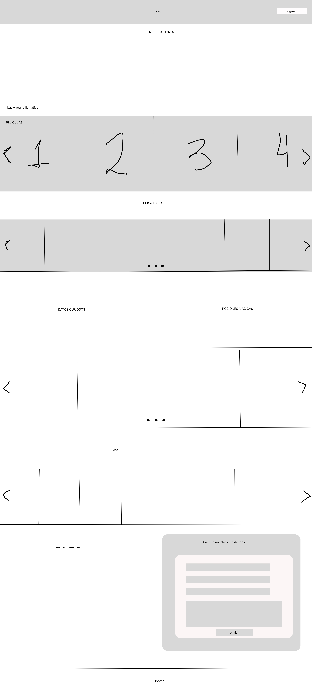
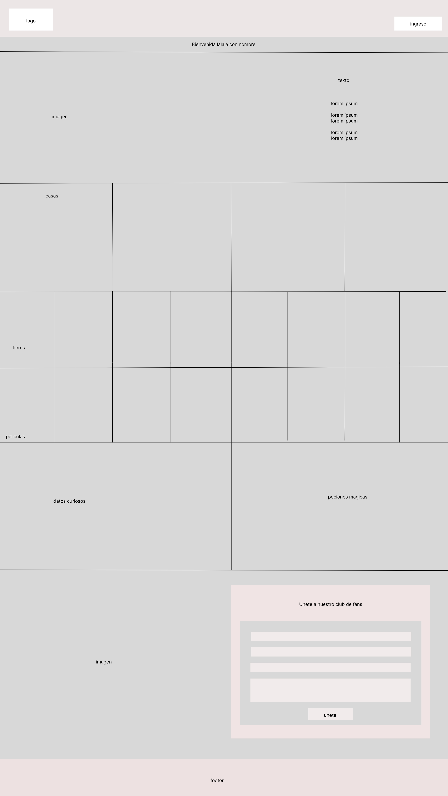
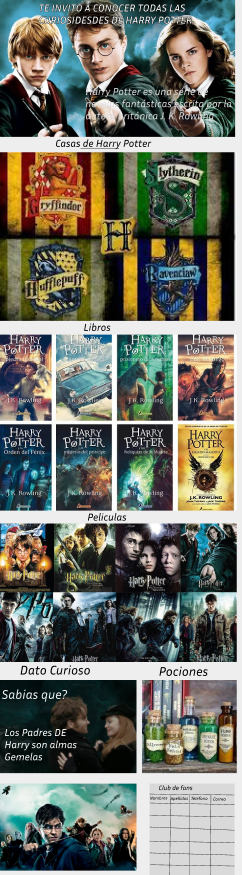
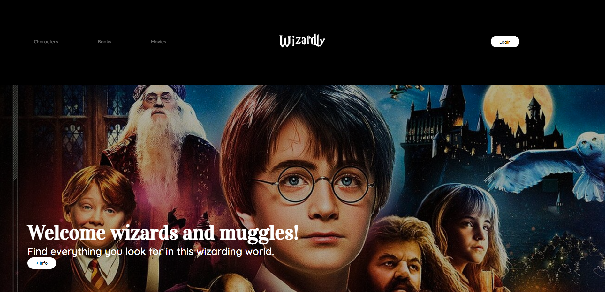
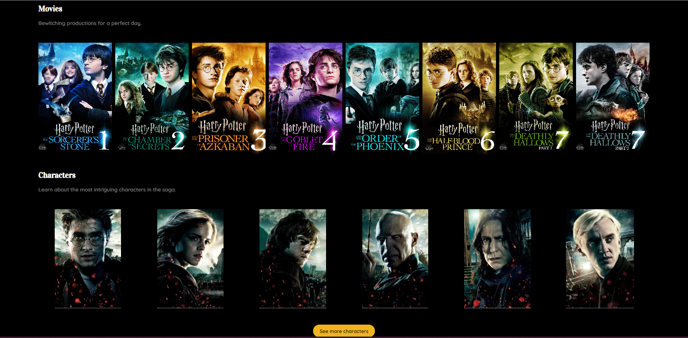
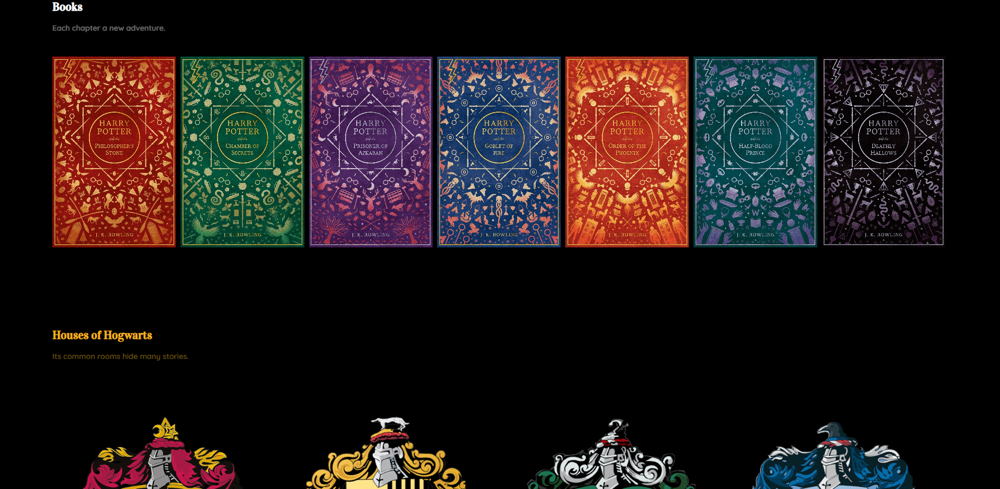
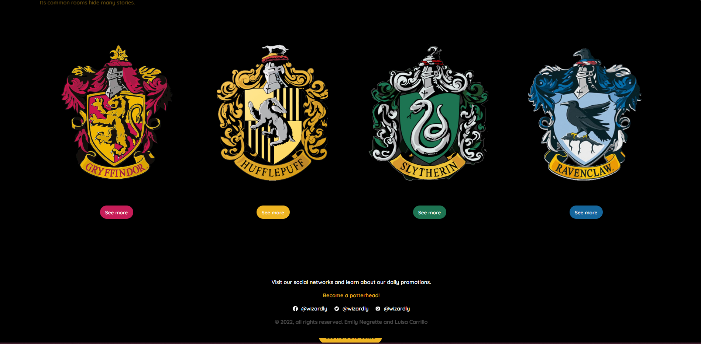
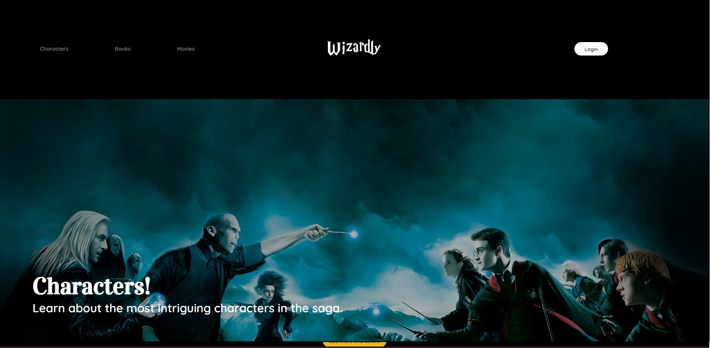
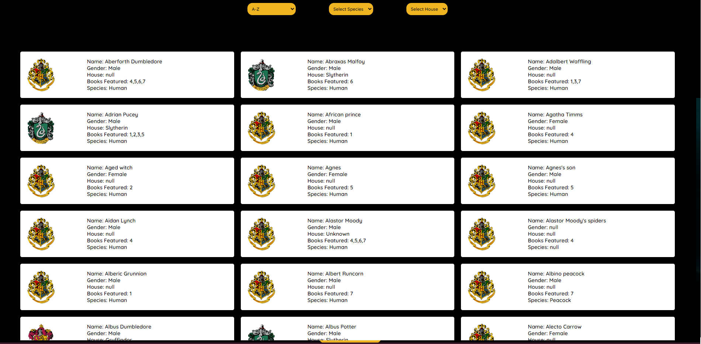
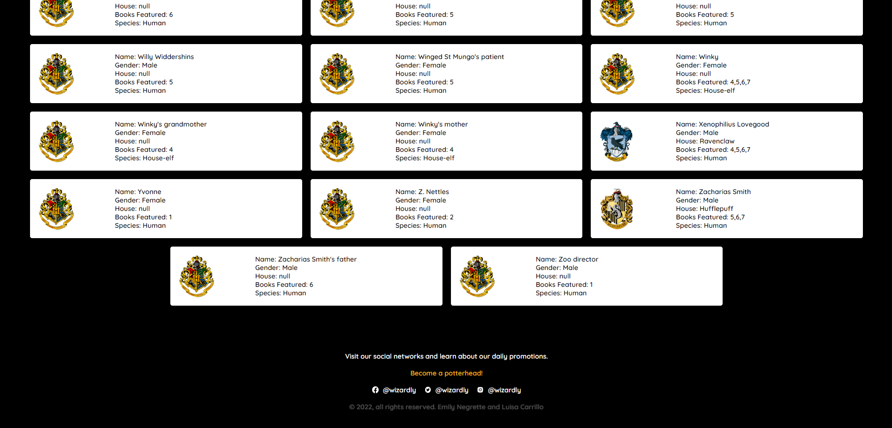

<h1 align="center"> Data Lovers - Harry Potter! </h1> 

Página web sobre Harry Potter :heart:***Wizardly***:heart:, donde sus usuarios podrán encontrar, obtener e indagar información sobre una de las marcas más exitosas del mundo de los magos.

## Investigación UX :nerd_face:: 

#### 1. Usuarixs y objetivos :family:

Yo como ***usuario principiante***, quisiera que la información que se mostrara sea sobre los personajes, para poder conocer a cada uno de ellos (seres mágicos y humanos).

Yo como ***usuario principiante***, quisiera conocer cuántas casas hay en Hogwarts, para saber cuántos estudiantes hay por cada casa.

***Criterio de aceptación:*** Quisiéramos que al filtrar la información lograramos ordenar alfabéticamente los personajes y filtrar las casas. 

### 2. Cómo fue tu proceso de diseño :art:

***Prototipo de baja fidelidad***

Leímos el readme proporcionado y definimos la página web que íbamos a diseñar. Realizamos bocetos basados en las opiniones de los usuarios, recopilando la información mas útil para el mismo. Para finalizar, efectuamos votaciones de acuerdo a las directrices que nos proporcionaron y así obtener un análisis de partida. 

***Prototipo de alta fidelidad***

Con el análisis obtenido pudimos iniciar nuestro diseño y de acuerdo a las votaciones se eligió el primer prototipo. 

 

 :sparkles: ***Prototipo final*** :sparkles:

 Para el último prototipado fue necesario ir iterando diseños hasta que pudimos cumplir con los diferentes requerimientos de ambos usuarios. 

 
 
 
 
 
 
 
 
#### 3. Solución problemas/necesidades :thinking:
Esta página web está diseñada para que los usuarios principiantes logren obtener información acerca de la fantástica historia de Harry Potter, basadas en la famosa saga de libros de la autora británica J.K Rowling. 

***Entre los principales problemas de los usuarios encontramos:***

1- No lograr conocer todos los personajes que participaron en esta novela y producción cinematográfica.

2-No saber cuántas casas existen en Hogwarts y los estudiantes que habitan en ella.

***Entre las principales necesidades de los usuarios encontramos:***

1- Conocer todos los personajes que participaroNn en las diferentes películas y libros de dicha autora.

2-Conocer las casas existentes en Hogwarts y los estudiantes que pertenecen a cada una de ellas.

Link a nuestra web:
https://luisaele28.github.io/data-lovers/

---------- SCL021 Data Lovers - Devs 2022, Luisa Carrillo & Emily Negrette ----------
 